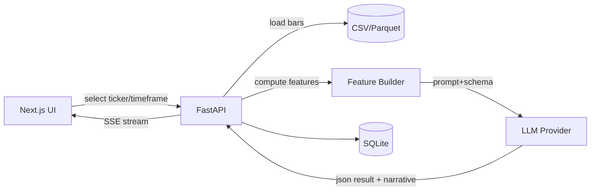

# LLM Analytics 落地方案（FastAPI + Next.js）

目标：基于已下载的 OHLCV 数据（当前由 `download_data.py` 生成 `data/stock_data.csv`），提供一个可操作的 Web UI：展示各股票的日线/周线/月线等数据，选择“用哪个 AI 分析哪个数据集/时间周期”，并展示可追溯、结构化的分析结果。

> 备注：此项目涉及“投资建议”。无论内部使用还是对外提供，都建议在 UI 与接口输出中加入显著免责声明，并将输出定位为“研究辅助/信息参考”，避免夸大确定性；同时保留模型输入数据与版本以便复核。

---

## Requirements

- 数据展示：
  - 支持按 `Ticker` + `Timeframe`（例如 `1D_15m`, `1M_1d`, `5Y_1wk` 等）查看 K 线与成交量。
  - 需要表格/统计摘要（例如最近 N 根K、涨跌幅、波动、均线等）。
- LLM 分析：
  - 能选择 Provider/Model（例如 OpenAI/Claude/DeepSeek/Qwen 等 OpenAI-compatible）。
  - 能选择分析“目标”（某个 `Ticker`、某个 `Timeframe`、某份数据文件或某个筛选后的子集）。
  - 结果必须是结构化（JSON schema）+ 可读的报告，同时保存历史与可复现输入。
  - 支持流式输出（SSE/WS）与任务状态（排队/运行中/完成/失败）。
- 工程与迭代：
  - MVP 先跑通：下载数据 → 浏览 → 点“分析” → 出结果 → 保存与回看。
  - 后续可扩：多数据源、多指标、多策略模板、多用户鉴权、队列与并发、成本控制、评估回测。

---

## Scope

- In：
  - FastAPI 后端（数据 API、分析任务 API、LLM 调用、结果存储）
  - Next.js 前端（图表、文件/模型选择、任务状态、结果展示与历史）
  - SQLite（MVP）作为元数据与结果存储；OHLCV 原始数据可先继续用 CSV/Parquet 文件
- Out（MVP 不做）：
  - 真实交易执行/下单
  - 完整的回测系统与策略资金曲线（可作为 Phase 3/4）
  - 复杂权限/团队协作（若需要再加 Auth）

---

## Current Status（基于现有仓库）

- 已有下载脚本：`download_data.py` 使用 `yfinance` 下载并合并输出到 `data/stock_data.csv`
- 当前数据 schema（示例）：`Timeframe, Period, Interval, Ticker, Datetime, Open, High, Low, Close, Adj Close, Volume`
- 目前没有后端服务与前端工程目录（需要新增）

---

## Proposed Architecture

### 组件划分

- **Backend（FastAPI）**
  - 读取/管理数据集（CSV/Parquet）
  - 按 ticker/timeframe 提供 K 线数据与摘要
  - 创建与执行 LLM 分析任务（异步/后台任务）
  - 校验并持久化结构化分析结果
  - SSE/WS 提供流式输出与进度
- **Frontend（Next.js）**
  - 数据浏览：ticker 列表、timeframe 切换、K 线图与指标
  - 分析面板：选择模型/模板/数据范围，发起任务
  - 结果页：结构化卡片 + 原始文本 + 引用数据范围 + 历史版本
- **Storage（MVP）**
  - `data/`：原始下载 CSV（短期继续沿用）
  - `var/`：运行期产物（SQLite、任务日志、缓存、导出文件等）
  - SQLite：任务、结果、数据集元数据（hash、行数、时间范围等）

### 数据流（建议：先“特征化”，再喂给 LLM）

不要把全量 OHLCV 直接喂给模型；先在 Python 做摘要/指标，减少 token、提高稳定性与一致性。

典型流程：
1) 用户在前端选 `Ticker` + `Timeframe` + 时间范围/最近 N 根K  
2) 后端拉取对应 bars → 计算指标/特征 → 生成“分析输入包”（JSON）  
3) LLM 基于输入包输出结构化结果（严格 schema）  
4) 保存任务与结果 → 前端展示与可追溯复现

---

## Backend Design（FastAPI）

### 目录建议

- `backend/`
  - `app/`
    - `main.py`（FastAPI 入口）
    - `api/`（路由）
    - `core/`（配置、日志、LLM client、鉴权预留）
    - `data/`（数据集管理、bar 查询、特征工程）
    - `analysis/`（prompt 模板、schema、任务执行器）
    - `db/`（SQLite models/migrations）
  - `scripts/`（下载/导入/转换工具）

### 数据 API（建议的最小集合）

- `GET /api/tickers`
  - 返回可用 ticker 列表（来自 `tickers.py` 或数据集扫描）
- `GET /api/timeframes`
  - 返回可用 timeframe 列表（来自 `timeframes.py` 或数据集扫描）
- `GET /api/datasets`
  - 返回数据集列表（默认包含 `data/stock_data.csv`），含：文件名、hash、行数、时间范围、可用 ticker/timeframe
- `GET /api/bars?ticker=...&timeframe=...&start=...&end=...&limit=...`
  - 返回 K 线序列（用于图表）
- `GET /api/summary?ticker=...&timeframe=...`
  - 返回摘要（最近涨跌、波动、均线、量能异常等）

### 分析任务 API

- `POST /api/analysis/jobs`
  - body：`ticker`, `timeframe`, `datasetId`/`file`, `window`（最近 N 根K 或时间范围）, `provider`, `model`, `template`, `temperature`…
  - 返回：`jobId`
- `GET /api/analysis/jobs/{jobId}`
  - 返回状态、参数、创建时间、错误信息（如有）
- `GET /api/analysis/jobs/{jobId}/stream`（SSE）
  - 流式输出：token/阶段进度（加载数据→算特征→LLM→校验→入库）
- `GET /api/analysis/jobs/{jobId}/result`
  - 返回结构化结果（JSON）+ 可读报告
- `GET /api/analysis/history?ticker=...`
  - 用于前端“历史分析”列表

### LLM 输出的结构化 Schema（强烈建议）

用 Pydantic 定义严格结构，避免“看起来像建议但不可解析/不可比对”的自由文本。

建议最小字段（可迭代）：
- `meta`: 使用的 `ticker/timeframe/window/datasetHash/model/promptVersion`
- `market_summary`: 当前趋势与波动描述（基于输入特征）
- `signals`: 关键技术信号列表（每条包含依据字段）
- `scenarios`: 2-3 个情景（base/bull/bear）与触发条件
- `risk`: 风险清单（流动性、跳空、宏观、财报等）
- `plan`: 研究计划/观察点（而非“保证盈利”的指令）
- `confidence`: 0-1 或 0-100，并说明不确定性来源
- `data_limitations`: 数据缺陷（缺失、时区、分红复权等）

实现方式：
- 优先用“JSON schema / tool calling / response_format”为强约束；
- 后端对结果做校验：校验失败则自动重试（带“你输出不符合 schema”提示），最多 N 次。

### 异步执行（MVP → 可扩）

MVP 路径（简单优先）：
- 使用 FastAPI background task + SQLite 记录状态；
- SSE 通过轮询 DB 或内存事件转发进度。

扩展路径（并发/稳定性）：
- 引入队列：Celery/RQ + Redis（或用 SQLite + 简易队列但不推荐）；
- 大任务与多用户下更稳定。

---

## Frontend Design（Next.js）

### 页面与交互

- `/` Dashboard
  - ticker 列表、搜索、最近价格变化（从 `/api/summary` 拉）
- `/ticker/[symbol]`
  - timeframe 切换（15m/1d/1wk/1mo…）
  - K 线图（含成交量），右侧展示摘要与指标
  - “发起分析”按钮（带模板选择）
- `/analysis/[jobId]`
  - 实时显示任务进度（SSE）
  - 完成后展示：结构化卡片 + 原始文本 + “输入数据范围/版本”
- `/datasets`
  - 数据集列表（hash、时间范围、包含 ticker/timeframe）
  - 可选：触发后端下载/导入（Phase 2）
- `/settings`（可选）
  - 仅展示当前 provider/model 选项与默认模板（API key 不建议从前端配置）

### 图表与组件建议

- K 线：`lightweight-charts`（轻量、交互好）
- 数据请求：`@tanstack/react-query`
- UI：`Tailwind CSS + shadcn/ui`

---

## Storage & Data Formats

### 推荐的落地结构（MVP）

- `data/stock_data.csv`（现状保留）
- `var/app.db`（SQLite：任务/结果/元数据）
- `var/datasets/`（可选：将 CSV 转 Parquet，提升读取与筛选性能）

### CSV → Parquet（建议尽早做）

随着数据变大，CSV 筛选会变慢；Parquet + 分区（ticker/timeframe）会显著改善。

建议后端提供一个“导入/转换脚本”：
- 读 `data/stock_data.csv`
- 清洗时区/日期类型
- 按 `Ticker/Timeframe` 分区写入 `var/datasets/bars/`
- 写入 SQLite dataset 元数据（hash、范围、行数）

---

## Prompting & Templates（可配置）

提供“分析模板”概念，让用户选择：
- `technical_summary`：技术面摘要 + 关键信号
- `risk_assessment`：风险因子与情景
- `positioning_idea`：研究型入场/出场条件（非强指令）
- `earnings_watch`：财报前后波动提示（需扩展数据源）

模板应版本化（`prompt_version`），并与结果一起保存，保证可追溯。

---

## Security & Ops（最小但必要）

- API key 只放后端环境变量（不要放前端与浏览器）
- 日志中脱敏：不打印 key、不打印完整 prompt（可打印 hash/摘要）
- 限流与成本控制：
  - 单用户并发限制、每日预算上限（Phase 2）
  - 强制窗口大小（例如最多最近 500 根K 的特征摘要）

---

## Implementation Plan（分阶段）

### Phase 1：MVP（1-3 天，跑通闭环）

- [ ] 新增 FastAPI 工程骨架（含配置、路由、CORS）
- [ ] 实现数据读取：从 `data/stock_data.csv` 按 ticker/timeframe 筛选返回 bars
- [ ] 实现分析任务：创建 job → 后台执行 → 结果入 SQLite
- [ ] LLM 接入：先支持 1 个 provider（OpenAI-compatible），结果强制 JSON schema
- [ ] Next.js：Ticker 列表页 + 详情页 K 线 + 发起分析 + 结果展示（含 SSE）

交付标准：
- 能在浏览器里选一只股票、切 timeframe、看到图；
- 点“分析”后能看到流式进度，最终落库并可回看历史结果。

### Phase 2：性能与可维护性（3-7 天）

- [ ] CSV 转 Parquet + 分区；bars 查询性能提升
- [ ] 增加指标/特征工程模块（MA/RSI/MACD/ATR/量能异常/支撑阻力粗略）
- [ ] 增加多模板、多模型选择与默认参数管理
- [ ] 错误处理与重试：LLM schema 校验失败自动重试

### Phase 3：产品化（可选）

- [ ] 鉴权（多用户）与分析历史隔离
- [ ] 队列化（Celery/RQ + Redis）与并发控制
- [ ] 基础评估：对历史窗口滚动生成分析，做一致性检查/可解释性对比

---

## Testing and Validation

- 后端：
  - 单元测试：特征工程、schema 校验、CSV/Parquet 读取
  - 集成测试：`POST /analysis/jobs` → 等待完成 → 校验结果可解析且字段齐全
- 前端：
  - 手工验收脚本：指定 ticker/timeframe，验证图表、发起分析、流式输出与结果渲染

---

## Risks and Edge Cases

- 数据质量：yfinance 的时区、缺失值、拆分/分红复权差异（`Adj Close` 的使用需明确）
- Token 成本：全量 OHLCV 直接喂模型会不可控；必须先特征化/摘要化
- 幻觉与确定性：输出需包含不确定性与数据限制；避免“保证收益”式表述
- 并发：多任务时 background task 不可靠，需要队列（Phase 2/3）

---

## Open Questions（决定后可进一步细化）

1) 你希望支持哪些 timeframe（是否要“月线/季线/年线”，还是用聚合生成）？
2) 分析更偏“技术面交易信号”，还是“长期基本面 + 新闻 + 财报”？（后者需要新增数据源）
3) 是否需要多用户/登录？如果需要，优先哪种方式（本地账号/Google OAuth/企业 SSO）？

